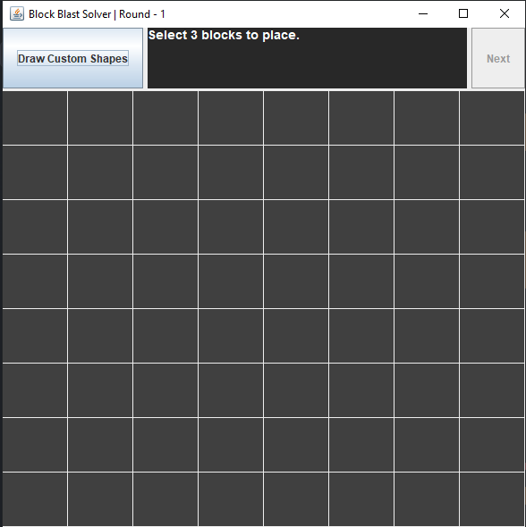

# Block Blast Solver

A mixed command-line & GUI advisor for the mobile puzzle game **Block Blast**. You play the game on your phone; this program tells you the optimal way to place each set of 3 blocks the game deals you, on an 8×8 grid.

> **Note on the block set:** the real Block Blast game has a much larger (and possibly procedurally varied) set of block shapes. The 5 shapes in this CLI & GUI build are **temporary example blocks** I'm using to validate the solver pipeline end-to-end. Full block-set support is intentionally deferred until the GUI lands in full and the user can draw arbitrary shapes — see [Roadmap](#roadmap).

## How it works

1. Open Block Blast on your phone.
2. Run the solver in your terminal or IDE.
3. Each round, click the 3 shapes the game dealt you.
4. The solver computes the best placement order and coordinates and prints them.
5. Mimic the placements on your phone.
6. The solver's internal grid updates to match. Repeat for each new round of 3 blocks.

## Sample run

```
Selected: BIG L (1/3)
Selected: UPSIDE DOWN SMALL T (2/3)
Selected: L (3/3)
Place BIG L at row 0, col 0
Place UPSIDE DOWN SMALL T at row 1, col 3
Place L at row 0, col 6
```


## Supported blocks (temporary example set)

These 5 shapes are **placeholder examples** used to validate the solver — they're not meant to mirror the actual Block Blast block set.

- **1 — L** (3 rows × 2 cols): `X. / X. / XX`
- **2 — REVERSE L** (3 rows × 2 cols): `.X / .X / XX`
- **3 — BIG L** (3 rows × 3 cols): `X.. / X.. / XXX`
- **4 — TWO BY TWO** (2 rows × 2 cols): `XX / XX`
- **5 — UPSIDE DOWN SMALL T** (2 rows × 3 cols): `.X. / XXX`

`X` = filled cell, `.` = empty cell, `/` = next row.

If the game gives you a shape outside this set, the CLI & GUI version cannot help with that round — that's an expected gap in this build, not a bug. The proper fix is custom-shaped input, which lands with the GUI in full (see [Roadmap](#roadmap)).

## How the solver works

For the 3 blocks you entered, the solver:

1. Generates all 6 permutations (orderings) of the blocks.
2. For each permutation, brute-force tries every `(row, col)` anchor for the first block, then expands the search to every anchor for the second, then the third — keeping only sequences where all three blocks fit.
3. Each candidate end-state grid is scored:
   - `score = clearedCells × 0.5 + largestConnectedEmptyArea × 0.25`
4. The placement sequence with the highest score wins.

Score weighting prioritizes actually clearing rows/columns (0.5) over preserving open space (0.25). The largest empty area is computed via flood fill.

## Requirements

- **Java 22** or newer
- **Maven** (for command-line builds — optional if you run from IntelliJ)

## Running

### From IntelliJ IDEA

Open the project as a Maven project and run `dev.pebbled.Main`.

### From the command line

```
mvn compile
java -cp target/classes dev.pebbled.Main
```

## Project structure

```
src/main/java/dev/pebbled/
├── Main.java                  # Entry point — launches the GUI (CLI launch commented out)
├── GameSession.java           # Round-by-round CLI flow
├── algorithm/
│   └── FloodFill.java         # Connected-region area calculation
├── blocks/
│   ├── IBlock.java            # Block contract: returns its boolean[][] shape
│   └── impl/                  # Concrete block shapes
│       ├── L.java
│       ├── ReverseL.java
│       ├── BigL.java
│       ├── TwoByTwo.java
│       └── UpsideDownSmallT.java
├── grid/
│   ├── Grid.java              # Wraps an int[][] grid + placement history
│   └── Placement.java         # (block, row, col) record
├── gui/
│   ├── BlockBlastFrame.java   # JFrame — owns grid state, wires panels together
│   ├── GridPanel.java         # 8×8 grid display
│   ├── BlockPanel.java        # Single block preview (clickable)
│   └── PalettePanel.java      # Row of 5 BlockPanels, tracks selection
├── solver/
│   └── Solver.java            # getTopGrid + generateBlockCombinations + helpers
└── utils/
    ├── BlockUtil.java         # placeBlock(grid, shape, row, col)
    └── GridUtil.java          # isSpaceEmpty, clearCompletedRow, scoring, printing
```

## Current limitations

- **Block set is a placeholder.** The 5 hard-coded shapes are example blocks I picked to exercise the solver — they don't represent the full set Block Blast actually uses, and any round with a shape outside this list isn't supported. Expanding to the real game's set is planned via custom-shape drawing in the GUI (see Roadmap), since enumerating Block Blast's full palette in code isn't necessarily feasible.
- **Empty starting grid.** Each session starts with an empty 8×8 grid — you have to start the solver at the same time you start a fresh game on your phone.
- **GUI is functional but minimal.** The grid renders and updates, the palette is clickable, placement instructions still print to the console rather than appearing inside the window. UX polish is on the roadmap.

## Roadmap

- [x] Swing GUI (basic): visual grid renderer, clickable block palette, state updates between rounds
- [ ] in-window placement display, distinct color for new placements vs. carried-over cells
- [ ] Custom shape input — let the user draw shapes the game presents that aren't in the built-in palette
- [ ] Save/load grid state across sessions
- [ ] Manual grid input on startup (so the solver can pick up an in-progress game)

## Author

Built by [Pebbleddd](https://github.com/Pebbleddd).
